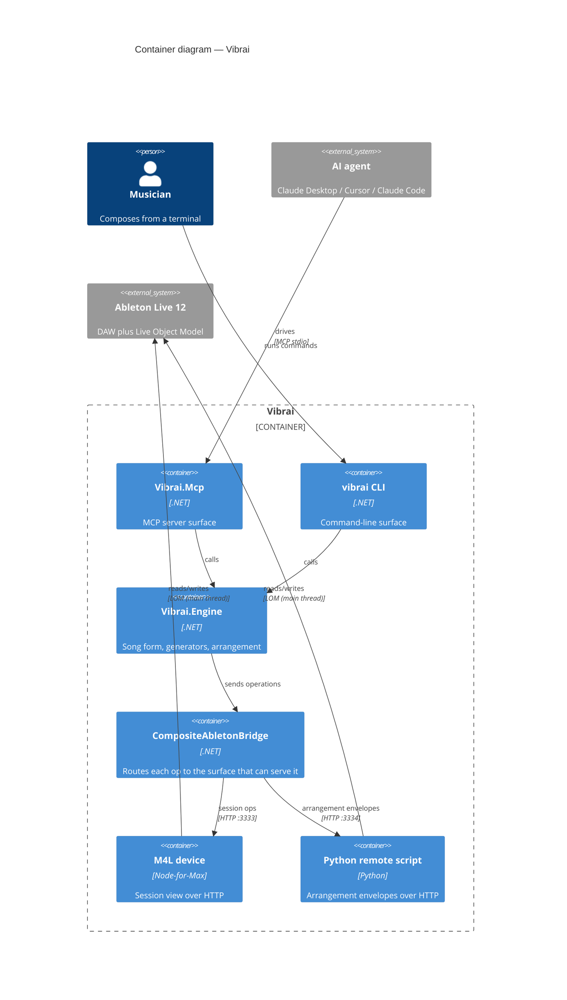

Vibrai lets an AI agent produce music inside Ableton Live. You talk to Claude; Claude creates tracks, loads instruments, writes MIDI, draws automation, and arranges a song — all through a Max for Live device wired into Live's Live Object Model. It ships as **two equal surfaces**: an MCP server (for Claude Desktop, Cursor, Claude Code) and a `vibrai` CLI.

What's interesting to write about isn't the music. It's that almost every hard bug lived in a *seam* — the boundary between two systems that each work fine alone: JSON Schema and an AI client's extension proxy, Node-for-Max and Live's main thread, the CLI and the MCP server, our engine and Ableton's genuinely-undocumented internals. Building a tool for AI agents surfaces these joints in a way that ordinary apps don't.

This is the lifecycle: brainstorm, design, implement, test, release, operate.

## The architecture, in one breath



Five .NET projects: `Vibrai.Engine` (the brain — song form, generators, arrangement), `Vibrai.Bridge` (talks to Live over HTTP), `Vibrai.Mcp` and `Vibrai` (the two surfaces), and a licensing project. Below the waterline: a Max for Live device (`vibrai.amxd`) running an Express server in Node-for-Max, and a Python remote script that wraps Live's LOM on a second port. The engine's design borrows song-form vocabulary from Song Sketch 2 and a per-part generator-network model from Wotja.

The rest of this article is about what that clean diagram hides.

## Brainstorm & design: two rules we made non-negotiable

Two decisions, made early and treated as **hard rules**, shaped everything after.

**1. MCP and CLI are equal surfaces. Always.** Every feature ships on both, in the *same PR* — never "MCP now, CLI later." A change that adds a tool to one surface without the other is treated as a *defect to justify*, not an approved divergence. When it's genuinely unclear whether a feature makes sense on both (something inherently interactive, say), the rule is to *stop and ask*, then record a one-line justification. "I assumed it wasn't worth it" is not an acceptable outcome.

This sounds like overhead. It paid for itself constantly, because the CLI became our primary test surface (more on that below), and because parity forced a clean engine boundary — anything a tool could do, a command could do, because both were thin shells over the same engine service.

**2. Every architecture diagram is Mermaid + C4.** No ASCII boxes, no PlantUML, no exported PNGs that drift from reality. C4 gives a consistent context→container→component→dynamic vocabulary across every spec, and Mermaid renders natively on GitHub and in the docs site, so diagrams stay diffable in review. A validation gate parse-checks every diagram block in CI, so a misspelled directive fails the build rather than shipping a broken picture.

Neither rule is about elegance for its own sake. Both are about **not letting a two-surface, many-document project drift out of sync** — which, at 1,500+ commits and 80-odd tools, it absolutely would have.

<Note>
  This post is the engineering story. For the non-technical version — why Vibrai is AI-optional, non-destructive, and deterministic, written for musicians rather than builders — see [Design principles](/design-principles).
</Note>

Design happened as written specs before code: `spec` → `implementation plan` → PR. The stock-sounds feature, the unified automation surface, the follow-action *removal* — each got a design doc and a plan committed before a line of implementation. The history reads like a research log instead of a pile of "fix stuff" commits.

## Implementation: the surfaces are thin, the seams are thick

The fun code — the generator networks, the song-form engine — was rarely where the time went. The time went into the bridges.

Live's LOM is **main-thread-only**. You cannot touch it from a worker thread; you defer work onto Live's Timer ticks. Pure-Python and IO can go off-thread, but the moment you read a track you're back on the main thread. This one constraint dictates the shape of the entire Python bridge.

And Live's automation model is split in a way that isn't obvious until it bites you: session-view operations and arrangement-view envelope operations don't live on the same surface. We started with everything through the M4L device, discovered the arrangement-automation route was fundamentally broken for envelopes, and ended up introducing a **second bridge** — a Python remote script on port 3334 for arrangement envelopes — wrapped by a `CompositeAbletonBridge` that routes each operation to whichever surface can actually serve it. The M4L device (port 3333) kept session view. That composite is invisible in the architecture diagram and was most of a sub-project.

The M4L device itself is a **four-layer contract**: an Express route, a proxy, a dispatcher, and — the part that bites you — a *post-build bundler*. Tests run against source; the published device ships a webpack bundle. Forget to rebuild the bundle and your tests are green while Live runs stale code.

## Testing: three independent witnesses

The testing philosophy is the part I'd most want another team to steal. For any non-trivial change we demand **three independent witnesses**:

1. **Engine unit tests** — fast, no Live required.
2. **A CLI integration run** — the just-built binary, against a live bridge.
3. **A `curl` probe at the HTTP layer** — hitting the bridge ports directly.

And a hard ordering rule: **prefer the CLI over the MCP for testing.** Why not test through the MCP server, the thing users actually use? Because the MCP layer wraps engine exceptions as opaque `Internal error` strings — it *hides the real failure*. Because the MCP server can be running a stale build while you edit, whereas the CLI invokes the freshly-built binary. Because CLI output diffs and asserts cleanly in CI. You only test through MCP when the thing under test *is* MCP-specific (tool schema, transport, an MCP-only flow).

The `curl` witness earns its keep by catching bugs that hide *between* layers: the CLI passes, but the bridge response is malformed, or the engine maps a bridge error wrong. If the CLI output and the raw HTTP response disagree, that disagreement *is* the bug — in the layer between them.

For anything that needs a real DAW, an integration harness launches a canonical test set in Ableton Live 12, confirms the M4L device finished loading, runs the integration suite, and — critically — **leaves Live running on failure** so the broken state can be inspected, but closes it cleanly on success.

## Release: the last mile is Apple's

Shipping a macOS app that embeds a .NET runtime, a Node bundle, and a Max device turned into its own project. Vibrai ships two artifacts: a signed + notarized `.pkg`, and — for Claude Desktop — a one-click `.mcpb` extension bundle that packs the MCP server binaries *and* the M4L device payload.

The notarization details are the kind of thing you only learn by failing:

- .NET under macOS **hardened runtime** needs specific entitlements — JIT and library-validation exceptions — or it won't launch signed.
- `.mcpb` archives **can't be stapled**, so Gatekeeper validates the notarization ticket *online* on first launch. The user needs internet the first time, but sees no warnings. Miss this and your "signed" bundle still trips Gatekeeper the moment someone downloads it (the file picks up `com.apple.quarantine`).
- The build script **submits to Apple's notary service and fails the build if Apple rejects it** — release-time, not deploy-time.

A pre-release security review ran before the 1.0 tag, with its findings treated as release gates rather than follow-ups.

## Operations: two war stories from the seams

### "The MCP server hangs." It never hung.

Users reported Vibrai hanging in an AI client. We ran all three witnesses — engine, CLI, curl. All three returned in under a second. Nothing hung. The stack was healthy.

The real signal was in the *client's* own log:

```
Cannot use 'in' operator to search for 'properties' in true
```

That's a **client-side crash in the extension proxy**, not a hang in our server. The trigger: a *boolean subschema* in our tool definitions. JSON Schema lets a subschema be the literal `true` or `false` (meaning "anything" / "nothing"). Perfectly legal. But the proxy walked the schema assuming every subschema is an object and did `'properties' in subschema` — which throws when `subschema` is `true`.

Where did the `true` come from? Our JSON options **front-insert** custom converters. System.Text.Json, when a converter owns a property, emits `true` for that property's subschema. A handful of tools emitted a boolean subschema, and the client fell over on the first one. It reproduced in *every* standalone build — and an in-process test that appended (rather than front-inserted) the converter showed a *false green*, which is why it survived so long.

The fix normalizes boolean subschemas at the schema-transform layer — `true → {}`, `false → {"not": {}}` — with a guard test, *and* a build step that fails the bundle build if the published server ever emits a boolean subschema again. We also filed it upstream.

The lesson: when an AI client "hangs," suspect the *client's* schema handling before your own server. The MCP contract is JSON Schema, and JSON Schema is bigger than any one consumer implements.

### The bridge that kept "dying"

The M4L Node bridge would periodically go dark mid-session — always, it seemed, right when you asked Live to load an instrument or when the UI was churning. Our first read was "our Node server is crashing." It wasn't (mostly).

An exit code of `2` turned out to be **Node-for-Max killing the node process** when Live's main thread was busy — UI churn, device loading. Node-for-Max is a supervisor: it kills node, respawns it twice, then *gives up*, leaving an outage until the device is reloaded. The Python bridge, on its own process, sailed through the same churn. Exit code `0` was just Max's `closebang` on patcher close — benign. We only added crash-forensics handlers to distinguish an *actual* JS crash from a supervised kill.

Knowing *which* death you're looking at changes the fix entirely. A supervised kill is an ops problem (reload the device). An uncaught exception is a code problem. We'd been treating them as one.

### And sometimes the right feature is no feature

Follow actions — Live's "after this clip, play that one" behavior — seemed like an obvious tool. We built a get/set surface for it. Then we actually probed every surface Live exposes: the M4L LOM, the Python LOM, and the Extensions SDK. **None of them expose `follow_action`.** Our get/set was a lying stub — it accepted calls and returned plausible values and did nothing.

So we *removed the surface*, on both MCP and CLI, scrubbed it from the docs, and wrote down the exact condition under which it could come back. A tool that can't do what it claims is worse than a missing tool — especially when the caller is an AI agent that will confidently tell the user it worked.

## The through-line

The seams between competent systems are where the engineering actually is. Live works. Node-for-Max works. System.Text.Json works. AI clients work. Every one of our worst bugs was a legal behavior on one side of a boundary meeting an assumption on the other. A `true` subschema. A main-thread-only object model. A supervisor that gives up after two retries. An API that quietly lacks the field you built a feature around.

Vibrai 1.0 is macOS-only, signed and notarized, ~80 tools across two surfaces, 14 genres. The music is fun. The seams were the work.
